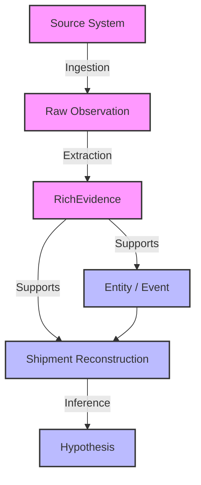

# AETHER-X Evidence Graph & Epistemic Rules

This document outlines the epistemological behavior of the AETHER-X network and how evidence cascades through the graph.

## 1. Graph Flow Architecture

The data lineage must always follow this strict directed cascade:

**Cardinal Rules:**
1. A **Hypothesis** can NEVER be treated as primary **Evidence**.
2. A **Reconstruction** can NEVER erase, alter, or collapse the **Evidence** that originated it.

## 2. Epistemic Model

All reconstructed fields must carry one of the following states:

- **UNKNOWN:** Base state. No data.
- **HYPOTHESIS:** A guess generated by the `HypothesisEngine` lacking strong physical backing.
- **INFERRED:** Synthesized from converging context, but not directly stated.
- **ESTIMATED:** Calculated by statistical/mathematical models (e.g. ETA).
- **DERIVED:** Structurally mapped from reliable secondary logic.
- **OBSERVED:** Hard physical truth captured by a trusted sensor (e.g., AIS position).
- **CONTRADICTION:** Two distinct sources assert conflicting, mutually exclusive facts.

### Promotion and Invalidation
- `INFERRED` **cannot** become `OBSERVED` without an explicitly tied physical sighting (new Evidence).
- Only the `ReconstructionEngine` (applying Evidence) and the `HypothesisEngine` (evaluating context) can mutate field states.
- If contradicting Evidence is applied, the state automatically becomes `CONTRADICTION`, maintaining references to `conflicting_evidence_ids`.

## 3. Multi-Source Independence

If two isolated sources affirm the same fact, they **MUST NOT** be deduplicated.

**Example Scenario:**
- **Source A (AIS):** Asserts Vessel IMO 1234567 is at BRSSZ. -> Generates `E1`.
- **Source B (Terminal Line-Up):** Asserts Vessel IMO 1234567 is at BRSSZ. -> Generates `E2`.

**Behavior:**
- The graph maintains both `E1` and `E2`.
- `PortCall P` links to both `E1` and `E2` as `supporting_evidence_ids`.
- **Reasoning:** In case Source A is later deemed corrupted or delayed, Source B sustains the truth. Collapsing them destroys resilience. Deduplication is reserved exclusively for multiple reads of the *same* observation from the *same* source.
